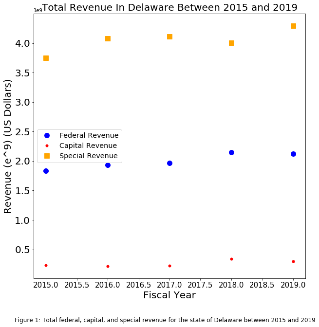

Clarity: your plot is very clear in what it is representing but i have 3 possible suggestions for readability. I especially like the 
shapes(squares triangles etc. which help me differentiate no matter the color filter i apply.
  - one of your data points is cut off by the legend which could be fixed very easily
  - it's possible dates with decimals could be confusing a notation like jun 15' or june 2015 might be more helpful 
  - finally you use e^9 notation which is slightly confusing because i think it's 10^9 which is normally represented as either 10^n or e+9 
or e9 so the e^9 is just a little confusing.

Aestheric: your plot very clearly communicates the data points and the dates visually and draws my attention immedieately with the few data points
and limited axes to the relevant data years. Great job!

